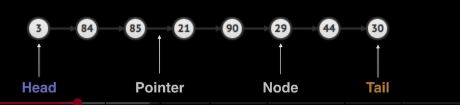

[BigOCheatSheet](https://www.bigocheatsheet.com/)
[Youtube Video](https://youtu.be/-Yn5DU0_-lw?list=PLDV1Zeh2NRsB6SWUrDFW2RmDotAfPbeHu)

## What is a linked list?
A linked list is a sequential list of nodes that hold data which point to other nodes also containing data.

## Where are linked lists used?
- Used in many List, Queue & Stack
implementations.
- Great for creating circular lists.
- Can easily model real world objects such
as trains.
- Used in separate chaining, which is
present certain Hashtable
implementations
to deal with hashing collisions.
- Often used in the implementation of adjacency lists for graphs.

## Terminology
Head: The first node in a linked list
Tail: The last node in a linked list
Pointer: Reference to another node
Node: An object containing data and pointer(s)

  

## Singly vs Doubly Linked Lists
Singly linked lists only hold a reference to the next
node. In the implementation you always maintain a
reference to the head to the linked list and a
reference to the tail node for quick additions/
removals.

With a doubly linked list each node holds a reference to
the next and previous node. In the implementation you
always maintain a reference to the head and the tail of
the doubly linked list to do quick additions/ removals
from both ends of your list.

### Singly & Doubly Linked lists Pros and Cons

DS  | Pros   | Cons
----|--------|--------
Singly Linked List | Uses less memory , Simpler implementation   | Cannot easily access previous elements
Doubly Linked List | Can be traversed backwards | Takes 2x memory

---- 
## Complexity Analysis

Operation  | Singly Linked   | Doubly Linked
----|--------|--------
Search | O(n) | O(n)
Insert at Head | O(1)   | O(1)
Insert at Tail | O(1) | O(1)
Remove at Head | O(1)   | O(1)
Remove at Tail | O(n) | O(1)
Remove in Middle | O(n)   | O(n)

> Remove in middle is actually O(n-1) for doubly linked , because if removing last element , we can use tail reference and remove in linear time O(1)

----

