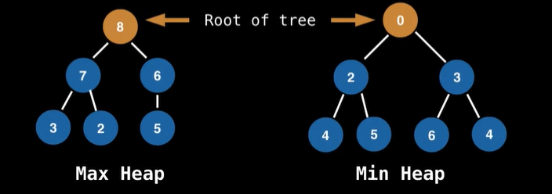

[BigOCheatSheet](https://www.bigocheatsheet.com/)    
[Heaps,Heapsort and PQ](https://youtu.be/pLIajuc31qk)       
[Priority Queue introduction](https://youtu.be/wptevk0bshY?list=PLDV1Zeh2NRsB6SWUrDFW2RmDotAfPbeHu)         
[Youtube Video 2](https://youtu.be/EoisnPvUkOA?list=PLDV1Zeh2NRsB6SWUrDFW2RmDotAfPbeHu)

## What is a Priority Queue?	

A priority queue is an Abstract Data Type (ADT) that operates similar to a normal queue except that each element has a certain priority.      
The priority of the elements in the	
priority queue determine the order in which	
elements are removed from the PQ.	    

> NOTE: Priority queues only supports comparable	
data, meaning the data inserted into the	
priority queue must be able to be ordered in	
some way either from least to greatest or	
greatest to least. This is so that we are able	
to assign relative priorities to each element.	

### But Queues are FIFO , how can we poll based on priority ?

Good question! In a standard queue, you can only insert at the rear and remove from the front (FIFO behavior). However, in a priority queue, the internal structure is different—typically, it uses a heap (binary heap is most common) to maintain priority order efficiently.         

- How Priority Queue Works with Insert & Poll
    - Insert (enqueue): Elements are inserted anywhere, but the data structure ensures they are positioned based on priority.
    - Poll (dequeue): The element with the highest priority (or lowest, depending on the implementation) is always removed first.

## What is a heap ?

A heap is a **tree** based DS that satisfies the **heap invariant** (also called heap property):        
If A is a parent node of B then A is ordered with respect to B for all nodes A, B in the heap.	

  

Heaps form the canonical, underlying Data structure for priority queues. Soo much so that priority queues are sometimes called heaps. Although this isn't technically correct since the priority queue again is an abstract data type. Meaning it can be implemented with other data structures also.     
  

But other implementations of PQ also exist:

- Binary Heap (Most Common)
- Balanced Binary Search Tree
- Unsorted List
- Sorted List

- Binary Heap (Most common)
    1. Min Heap → The smallest (highest priority) element is always at the top.
    2. Max Heap → The largest (highest priority) element is always at the top.
    **Operations**:
    - Insertion: O(log N)
    - Deletion (Extract Min/Max): O(log N)
    - Peek (Get Min/Max): O(1)

- Balanced Binary Search Tree (e.g., Red-Black Tree)
    - Operations: O(log N) for insertion and deletion.

- Unsorted List
    - Insertion: O(1)
    - Deletion (Finding highest priority): O(N)

- Sorted List
    - Insertion: O(N)
    - Deletion: O(1) (Removing the first element)

## When and where is a PQ used?	
- Used in certain implementations of Dijkstra's	shortest Path algorithm.	
- Anytime you need the dynamically fetch the 'next best' or 'next worst' element.	
- Used in Huffman coding (which is often used for lossless data compression).	
- Best First Search (BFS) algorithms such as A*	use PQs to continuously grab the next most promising node.  
- Used by Mimimum Spanning Tree (MST) algorithms.

## Complexity Analysis for PQ
> Assumes that PQ is constructed using a Binary Heap

Operation  | Time
----|--------
BH Construction | O(n)
Polling | O(log(n))
Peeking | O(1)
Adding | O(log(n))

> NOTE : There is an algorithm that constructs a binary heap from an unordered list in linear time. This algorithm also forms the basis for heap 

Operation  | Time
----|--------
Naive Removing | O(n)
Advanced removing with help from hash table | O(log(n))
Naive Contains | O(n)
Contains check with help of a hash table | O(1)

> Using a hash table to help optimize these operations does take up linear space and also adds some overhead to the binary heap implementation.	

------------------
------------------

