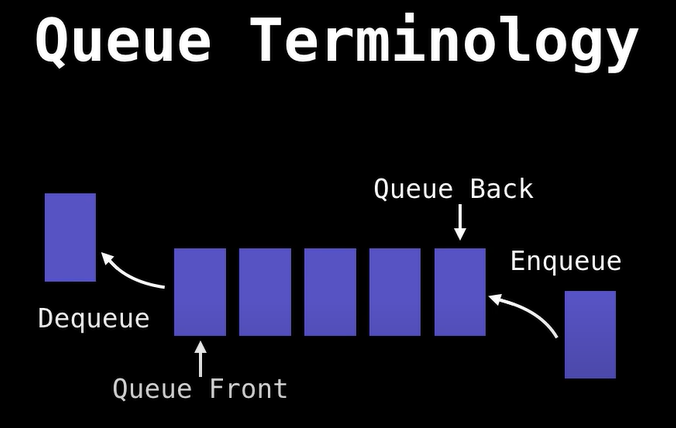

[BigOCheatSheet](https://www.bigocheatsheet.com/)       
[Youtube Video 1](https://youtu.be/KxzhEQ-zpDc?list=PLDV1Zeh2NRsB6SWUrDFW2RmDotAfPbeHu)
[Youtube Video 2]()     

## What is a Queue?
A queue is a linear data structure which models real world queues by having two primary operations, namely enqueue and dequeue.	

  

Enqueue = Adding = Offering
Dequeue = Removing = Polling

## When and where is a Queue used?
- Any waiting line models a queue, for example a lineup at a movie theatre.
- Can be used to efficiently keep track of the x most recently added elements.
- Web server request management where you want first come first serve.
- Breadth first search (BFS) graph traversal setting

## Complexity Analysis

Operation  | Time Complexity
----|--------
Enqueue | O(1)
Dequeue | O(1)
Peeking | O(1)
Contains | O(n)
Removal | O(1) 
IsEmpty | O(1) 

### Queue example usecase - BFS on a graph

``` Pseudo Code
Let Q be a Queue	
Q. enqueue (starting_node)	
starting_node.visited = true

While Q is not empty Do	
    node = Q. dequeue ()	
    For neighbour in neighbours (node):
        If neighbour has not been visited:	
            neighbour.visited = true	
            Q. enqueue (neighbour)
```
------

# Queue Implementation Comparison in Python

## 1. Queue using Arrays (Lists in Python)
- **Implementation:** Uses a list where elements are enqueued at the end and dequeued from the front.
- **Operations:**
  - **Enqueue:** `O(1)` (append to the end)
  - **Dequeue:** `O(n)` (removal from the front shifts all elements)
- **Pros:** Simple to implement.
- **Cons:** Inefficient due to shifting elements when dequeuing.

---

## 2. Queue using Singly Linked List
- **Implementation:** Each node stores data and a pointer to the next node.
- **Operations:**
  - **Enqueue:** `O(1)` (insert at tail)
  - **Dequeue:** `O(1)` (remove from head)
- **Pros:** Efficient for large data, no shifting needed.
- **Cons:** Extra memory for pointers.

---

## 3. Queue using Doubly Linked List
- **Implementation:** Each node has a `prev` and `next` pointer.
- **Operations:** Same as a singly linked list (`O(1)` for enqueue and dequeue).
- **Pros:** Can be used for both queue and deque operations.
- **Cons:** Slightly more memory overhead due to extra pointer.

---

## 4. Queue using Two Stacks
- **Implementation:** Uses two stacks (one for enqueue, one for dequeue).
- **Operations:**
  - **Enqueue:** `O(1)`
  - **Dequeue:** `O(n)` (only when `out_stack` is empty)
- **Pros:** Avoids shifting issues in lists.
- **Cons:** Higher time complexity for worst-case dequeue.

---

## Comparison Table

Implementation               | Enqueue Time | Dequeue Time | Space Complexity | Pros                                       | Cons                                   
-----------------------------|-------------|-------------|------------------|--------------------------------------------|--------------------------------------  
**Array (List)**             | O(1)        | O(n)        | O(n)             | Simple, built-in support                   | Slow dequeue due to shifting          
**Singly Linked List**       | O(1)        | O(1)        | O(n)             | Efficient operations, no shifting          | Extra memory for pointers             
**Doubly Linked List**       | O(1)        | O(1)        | O(n)             | Can be used for deque operations           | More memory overhead                  
**Two Stacks**               | O(1)        | O(n) worst / O(1) amortized | O(n) | Uses existing stack data structure | Can have slow dequeue in worst case  

---

## Which One to Choose?
- **Use an array-based queue** when memory is not a concern and dequeuing speed isn't critical.
- **Use a singly linked list** when fast `O(1)` operations are needed for both enqueue and dequeue.
- **Use a doubly linked list** when you need a deque-like structure.
- **Use two stacks** when working in a stack-oriented environment but still needing a queue.


---------

# Alternative Ways to Implement a Queue in Python

## 1. Using `collections.deque` (Recommended)
- **Implementation:** `deque` (double-ended queue) is optimized for fast appends and pops from both ends.
- **Operations:**  
  - **Enqueue:** `O(1)` (append to right)  
  - **Dequeue:** `O(1)` (pop from left)  
- **Pros:** Highly efficient, no shifting required like lists.  
- **Cons:** No built-in size limit (unless specified).  

---

## 2. Using `queue.Queue` (Thread-Safe)
- **Implementation:** Python’s built-in `queue.Queue` class, designed for multi-threading.
- **Operations:**  
  - **Enqueue:** `O(1)`  
  - **Dequeue:** `O(1)`  
- **Pros:** Thread-safe, comes with blocking operations (`get`, `put`).  
- **Cons:** Slightly slower due to locking mechanisms.

---

## 3. Using Priority Queue (`heapq`)
- **Implementation:** Uses a **min-heap** for priority-based queuing.  
- **Operations:**  
  - **Enqueue:** `O(log n)` (heap insertion)  
  - **Dequeue:** `O(log n)` (heap removal)  
- **Pros:** Useful when elements must be processed in priority order.  
- **Cons:** Not a regular FIFO queue.  

---

## 4. Circular Queue (Fixed Size)
- **Implementation:** Uses a fixed-size array with a circular buffer.
- **Operations:**  
  - **Enqueue:** `O(1)`  
  - **Dequeue:** `O(1)`  
- **Pros:** Prevents unnecessary memory reallocation.
- **Cons:** Needs extra logic for handling full/empty conditions.  

---

## 5. Using a Generator (Lazy Evaluation)
- **Implementation:** Uses a Python generator function to yield elements one by one.
- **Operations:**  
  - **Enqueue:** `O(1)` (yield an item)  
  - **Dequeue:** `O(1)` (next element from the generator)  
- **Pros:** Efficient memory usage for infinite sequences.
- **Cons:** Once dequeued, the element is lost forever.  

---

## Comparison Table

Implementation | Best For | Performance   
-------------|---------|-----------   
**`collections.deque`** | General-purpose queue | ✅ Fastest, `O(1)` operations   
**`queue.Queue`** | Multi-threaded apps | ✅ Thread-safe but slower   
**`heapq`** | Priority queues | 🔄 `O(log n)` operations   
**Circular Queue** | Fixed-size queues | ⚙️ Efficient but needs extra logic   
**Generator** | Streaming data | ⚡ Memory-efficient but one-time use   

---

## Which One Should You Use?
- **Use `collections.deque`** for general-purpose FIFO queues (`O(1)` operations).
- **Use `queue.Queue`** if you need thread safety.
- **Use `heapq`** for priority-based queueing.
- **Use a Circular Queue** when working with a fixed-size buffer.
- **Use a Generator** when streaming large datasets in a memory-efficient way.

