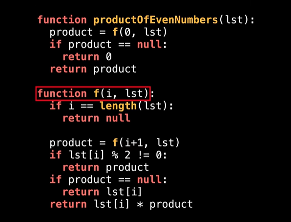
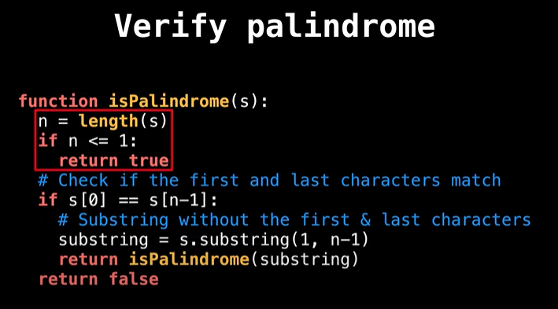

[Youtube Video](https://youtu.be/44TwrxjfIfo?list=PLDV1Zeh2NRsCmu1lb9grUcljeYJtmgmYc)

## What is a recursive function??

Any function that calls itself is called a "Recursive" function.
This technique is commonly used in programming to solve problems that can be broken down into smaller more manageable sub problems.

Recursive functions are very useful When the problem can be represented in a tree like structure.

## Recursion components	
Recursive functions can be thought of as being broken down into a few components:	
- The first is the base case which is the terminating condition for the recursion. Every recursive function	has a base case, either implicit or explicit, otherwise the recursion never ends.	
- The next component of a recursive function is the	recursive call to the same function. A crucial part about the recursive call is the transition to a smaller subproblem that gets you closer to the base case.
- The last component of the recursion is the body of the function, or the work being done in the function itself to solve the problem.	

### example
``` python
# Sums all the numbers from 1	
# to N for any number N >= 0	
# E.g Sum (3) = 1 + 2 + 3 = 6	
def Sum(n):	
    if n <= 0:	
        return	0	
    return Sum (n-1)+ n	
```

--------
---------
--------

## Beginner Recursion
[Multiply with recursion](https://youtu.be/tIthmhm8xKc?list=PLDV1Zeh2NRsCmu1lb9grUcljeYJtmgmYc)     
[Loops and wrappers](https://youtu.be/JBFFWnZIPx8?list=PLDV1Zeh2NRsCmu1lb9grUcljeYJtmgmYc)

> Multiply odd numbers in a list with recursion
  

[Strings and Palindromes](https://youtu.be/n1AUAP7FdXI?list=PLDV1Zeh2NRsCmu1lb9grUcljeYJtmgmYc)

  

----------------

### [Multiple Return Values](https://youtu.be/_RaIpPQ5aP8?list=PLDV1Zeh2NRsCmu1lb9grUcljeYJtmgmYc)          

- Handy when we want to capture/compute more than one thing inside a function.	
- Can make functions contain more logic.        
### [Divide and Conquer](https://youtu.be/ib4BHvr5-Ao?list=PLDV1Zeh2NRsCmu1lb9grUcljeYJtmgmYc)
